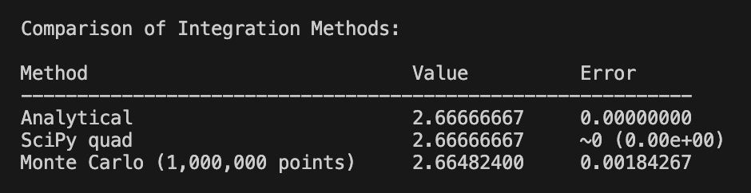

# Monte Carlo Integration vs Analytical and SciPy Methods

The Monte Carlo method was used to estimate the integral of the function `f(x) = x²` over the interval `[0, 2]`. The estimated result was compared against both the analytical solution and the result produced by SciPy's `quad` function.

## Key observations:

* **Monte Carlo Integration** demonstrated a reasonably accurate result, especially when using a large number of random points (e.g., 1,000,000).
* **Analytical Integration** provided the exact value:

  $$
  \int_0^2 x^2 \, dx = \left. \frac{x^3}{3} \right|_0^2 = \frac{8}{3} \approx 2.6667
  $$

* **SciPy's `quad` method** closely matched the analytical result with a very low numerical error, making it ideal for precise computations.

While the Monte Carlo approach is less efficient in terms of precision for simple integrals, it is very useful when dealing with:

* Higher-dimensional integrals,
* Complex or irregular domains,
* Functions with unknown analytical primitives.

## Comparison Results example (Monte Carlo vs Analytical vs SciPy)

## Conclusion: 
The experiment confirms the validity of the Monte Carlo method as a stochastic numerical integration tool. However, for simple and well-behaved functions, analytical or numerical methods like SciPy's `quad` are more efficient and accurate.
